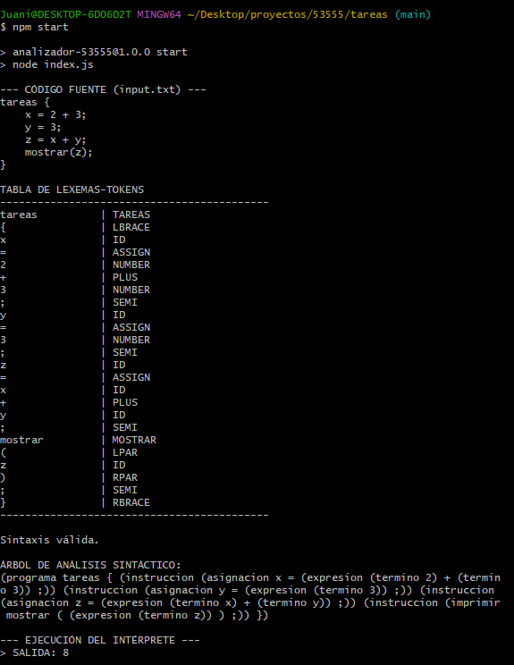
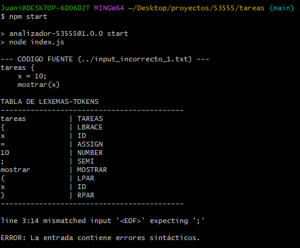
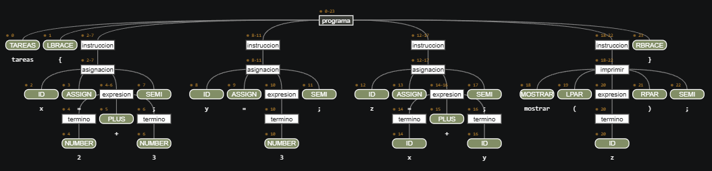

# Analizador de Lenguaje "Tareas" - UTN FRM (Legajo 53555)

Este proyecto implementa un analizador léxico, sintáctico e intérprete para un lenguaje específico definido en notación EBNF, utilizando ANTLR4 y JavaScript sobre Node.js. El desarrollo sigue los lineamientos de la Guía de Estudio de la asignatura.

## Instalación

### 1. Clonar el repositorio
Para obtener una copia local del proyecto, ejecutá el siguiente comando en tu terminal:
```
git clone https://github.com/juanigarciadev/53555.git
```

### 2. Navegar al directorio
Accedé a la carpeta donde se encuentran los archivos fuente del proyecto:
```
cd 53555
```

### 3. Instalar las dependencias
Descargá el entorno de ejecución de ANTLR4 para JavaScript necesario para que el proyecto funcione:
```
npm install
```

## Instrucciones de Uso

### 1. Preparar la entrada
El analizador procesa el código fuente desde el archivo input.txt. Aseguráte de que este archivo exista en la raíz del proyecto. El lenguaje requiere que el código esté envuelto en un bloque tareas { ... } y que las sentencias terminen en punto y coma. Ejemplo:

```
tareas {
    x = 2 + 3;
    y = 3;
    z = x + y;
    mostrar(z);
}
```

### 2. Ejecutar el proyecto
Para iniciar el proceso de análisis e interpretación, ejecutá el comando configurado en el package.json:
```
npm start
```

## Resultados del análisis

### Salida correcta


### Salida incorrecta


### Árbol de derivación
El siguiente gráfico representa la estructura jerárquica generada para el código de prueba:



## Tareas realizadas por el analizador

De acuerdo a la consigna y las pautas de trabajo, el programa realiza lo siguiente:

1. Análisis Léxico y Sintáctico: Valida el código fuente e informa si la entrada es correcta. En caso de error, detalla la línea y la causa del problema.
2. Tabla de Lexemas-Tokens: Genera una visualización en consola con cada lexema reconocido y su respectivo token (ej. ID, NUMBER, ASSIGN, PLUS).
3. Árbol de Análisis Sintáctico: Construye y muestra la estructura jerárquica del código en formato de texto (Parse Tree).
4. Interpretación: Traduce y ejecuta la lógica semántica (asignaciones y operaciones) utilizando un patrón Visitor.

## Estructura del repositorio

* Tareas.g4: Definición de la gramática (Lexer y Parser) basada en la EBNF asignada.
* index.js: Punto de entrada que coordina el flujo de datos entre el Lexer, Parser y el archivo de entrada.
* CustomTareasVisitor.js: Clase que hereda de TareasVisitor para implementar la lógica de ejecución y manejo de memoria.
* input.txt: Archivo de entrada con el código fuente a analizar.
* Archivos de prueba: Ejemplos requeridos para casos de éxito y falla (ej. input_correcto_2.txt, input_incorrecto_1.txt).